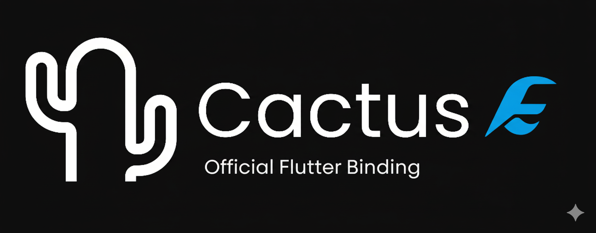

Official Flutter plugin for Cactus, a framework for deploying LLM/VLM/TTS models locally in your app. Requires iOS 12.0+, Android API 24+, Flutter 3.3.0+. For iOS, ensure you have cocoapods or install with `brew install cocoapods`.

## Resources
[](https://github.com/cactus-compute/cactus) [](https://huggingface.co/Cactus-Compute/models?sort=downloads) [](https://discord.gg/bNurx3AXTJ) [](https://cactuscompute.com/docs/flutter#video-walkthrough)

## Installation
Execute the following command in your project terminal:
```bash
flutter pub add cactus
```
*N/B*: To build locally or use this repo, see instructions in `example/README.md`

## Text Completion
```dart
import 'package:cactus/cactus.dart';

final lm = await CactusLM.download(
    modelUrl: 'https://huggingface.co/Cactus-Compute/Gemma3-270m-Instruct-GGUF/resolve/main/gemma-3-270m-it-Q8_0.gguf',
    contextSize: 2048,
);

lm.init()

final messages = [ChatMessage(role: 'user', content: 'Hello!')];
final response = await lm.completion(messages, maxTokens: 100, temperature: 0.7);
```
## Embeddings
```dart
import 'package:cactus/cactus.dart';

final lm = await CactusLM.download(
    modelUrl: 'https://huggingface.co/nomic-ai/nomic-embed-text-v2-moe-GGUF/resolve/main/nomic-embed-text-v2-moe.Q8_0.gguf',
    contextSize: 2048,
    generateEmbeddings: true,
);
lm.init()

final text = 'Your text to embed';
final result = await lm.embedding(text);
```
## Visual Language Models
```dart
import 'package:cactus/cactus.dart';

final vlm = await CactusVLM.download(
    modelUrl: 'https://huggingface.co/Cactus-Compute/SmolVLM2-500m-Instruct-GGUF/resolve/main/SmolVLM2-500M-Video-Instruct-Q8_0.gguf',
    mmprojUrl: 'https://huggingface.co/Cactus-Compute/SmolVLM2-500m-Instruct-GGUF/resolve/main/mmproj-SmolVLM2-500M-Video-Instruct-Q8_0.gguf',
);

vlm.init()

final messages = [ChatMessage(role: 'user', content: 'Describe this image')];

final response = await vlm.completion(
    messages,
    imagePaths: ['/absolute/path/to/image.jpg'],
    maxTokens: 200,
    temperature: 0.3,
);
```
## Cloud Fallback
```dart
import 'package:cactus/cactus.dart';

final lm = await CactusLM.download(
    modelUrl: 'https://huggingface.co/Cactus-Compute/Qwen3-600m-Instruct-GGUF/resolve/main/Qwen3-0.6B-Q8_0.gguf',
    contextSize: 2048,
    cactusToken: 'enterprise_token_here',
);

lm.init()

final messages = [ChatMessage(role: 'user', content: 'Hello!')];
final response = await lm.completion(messages, maxTokens: 100, temperature: 0.7);

// local (default): strictly only run on-device
// localfirst: fallback to cloud if device fails
// remotefirst: primarily remote, run local if API fails
// remote: strictly run on cloud
final embedding = await lm.embedding('Your text', mode: 'localfirst');
```

## Agents
```dart
import 'package:cactus/cactus.dart';

final agent = await CactusAgent.download(
    modelUrl: 'https://huggingface.co/Cactus-Compute/Qwen3-600m-Instruct-GGUF/resolve/main/Qwen3-0.6B-Q8_0.gguf',
);

agent.init()

agent!.addTool(
    'tool_name',
    Tool(),
    'Tool info',
    {
    'parameter': Parameter(
        type: 'string',
        description: 'The parameter you need!',
        required: true,
    ),
    },
);

final messages = [ChatMessage(role: 'user', content: 'Hello!')];

final response = await agent.completionWithTools(
    messages,
    maxTokens: 200,
    temperature: 0.3,
);
```